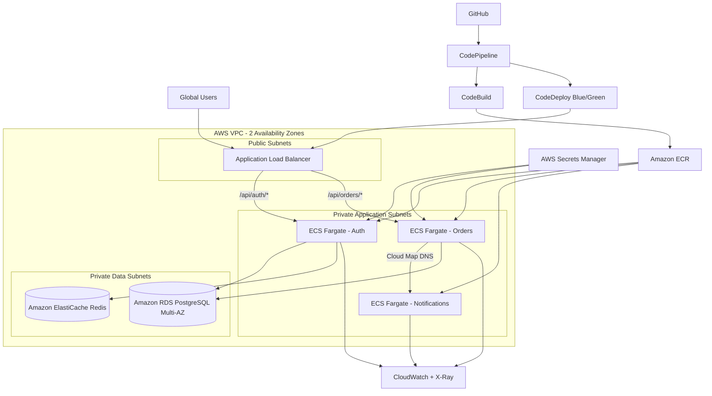

# Solution Architecture

## Network boundaries

The ALB is the only internet-facing component. ECS tasks, RDS, and Redis are deployed in private subnets. Security groups allow only the minimum required flows.
