# AWS ECS Fargate Microservices

**AWS Solutions Architect - Associate Graduation Project — Project 6**

This repository contains the two mandatory project deliverables first, followed by optional implementation artifacts.

## Submission

### 1. Solution Architecture Diagram

The architecture source is available in Draw.io format:

- [Draw.io source](01-architecture-diagram/architecture.drawio)
- [Architecture folder](01-architecture-diagram)

Current preview:



### 2. Project Documentation

The complete project documentation is included below and is also available in:

- [Project documentation folder](02-project-documentation)

---

## Project 6 — Containerized Microservices with ECS Fargate and Service Discovery

### Objective

The project migrates a monolithic application into three microservices — **Auth**, **Orders**, and **Notifications** — and runs them on **Amazon ECS with AWS Fargate**.

The architecture demonstrates:

- container images stored in **Amazon ECR**;
- microservices running as **ECS Fargate services**;
- external routing through an **Application Load Balancer**;
- private service-to-service discovery with **AWS Cloud Map**;
- sensitive configuration stored in **AWS Secrets Manager**;
- shared session caching with **Amazon ElastiCache for Redis**;
- CI/CD with **AWS CodePipeline and AWS CodeDeploy** using blue/green deployment;
- distributed tracing with **AWS X-Ray**.

### Microservices

#### Auth Service

Handles authentication and session creation. Session state is kept in Redis so Auth tasks remain stateless and can scale horizontally.

#### Orders Service

Handles order requests. It is exposed through the ALB and communicates with the Notifications service through Cloud Map DNS.

#### Notifications Service

Receives internal notification requests. It is not directly exposed to the internet.

### Request flow

```text
User
  |
  v
Application Load Balancer
  |------------------------|
  | /api/auth/*            | /api/orders/*
  v                        v
Auth Service           Orders Service
  |                        |
  v                        | AWS Cloud Map
ElastiCache Redis           v
                       Notifications Service
```

### ECS Fargate

Each microservice is packaged as a Docker image and runs as its own ECS service. Fargate is used so the application does not need to manage EC2 worker nodes.

Services can scale independently according to demand.

### Amazon ECR

Each microservice has its own private image repository in Amazon ECR. Image scanning can be enabled on push before new images are deployed.

### Application Load Balancer

The ALB is the public entry point and uses path-based routing.

```text
/api/auth/*    -> Auth service
/api/orders/*  -> Orders service
```

The Notifications service remains private.

### AWS Cloud Map

Cloud Map provides DNS-based service discovery for internal communication.

Example private service name:

```text
notifications.microservices.local
```

This allows the Orders service to locate Notifications without knowing individual ECS task IP addresses.

### AWS Secrets Manager

Application secrets and credentials are stored outside the source code and container images. ECS task roles can be granted only the permissions required to read the relevant secrets.

### ElastiCache for Redis

Redis provides shared session storage across stateless Auth tasks. This allows multiple Fargate tasks to handle requests for the same authenticated user.

### High availability and scaling

The solution is designed across two Availability Zones.

- The ALB spans public subnets in both AZs.
- ECS tasks run in private application subnets.
- ECS services can run multiple tasks and use Service Auto Scaling.
- Redis is shared across the stateless application tasks.

### CI/CD and blue/green deployment

The deployment flow is:

```text
GitHub
  |
  v
CodePipeline
  |
  v
CodeBuild
  |
  v
Amazon ECR
  |
  v
CodeDeploy
  |
  v
ECS Blue / Green task sets
```

CodeDeploy can create a new ECS task set, validate it through an ALB target group, shift traffic to the new version, and roll back when deployment health checks fail.

### AWS X-Ray

AWS X-Ray provides distributed tracing across calls between the microservices and helps visualize latency and failures across the service chain.

### Security

The proposed design follows these principles:

- only the ALB is internet-facing;
- Fargate tasks run in private subnets;
- security groups restrict traffic between components;
- application secrets are stored in Secrets Manager;
- IAM task roles follow least privilege;
- container images are stored in private ECR repositories.

### Architecture decisions

| Requirement | AWS service / design |
| --- | --- |
| Run containers without managing servers | ECS Fargate |
| Private container registry | Amazon ECR |
| Public Layer 7 routing | Application Load Balancer |
| Internal service discovery | AWS Cloud Map |
| Secret storage | AWS Secrets Manager |
| Shared session cache | ElastiCache for Redis |
| Automated deployment | CodePipeline + CodeDeploy |
| Safe releases | ECS blue/green deployment |
| Distributed tracing | AWS X-Ray |

### Optional implementation artifacts

The folder [03-optional-demo](03-optional-demo) contains supporting implementation material such as sample microservices, Docker Compose, Terraform, CI/CD templates, and operational notes.

These artifacts are **optional supporting material**. This repository does **not** claim that the full AWS environment has been deployed, and no live URL, screenshots, or demo video are part of the mandatory submission.

---

## Repository structure

```text
.
├── README.md
├── 01-architecture-diagram/
│   ├── architecture.drawio
│   ├── architecture.svg
│   └── README.md
├── 02-project-documentation/
│   └── README.md
└── 03-optional-demo/
    ├── README.md
    └── artifacts/
```

## Mandatory deliverables

1. **Solution Architecture Diagram** — `01-architecture-diagram`
2. **GitHub repository with complete project documentation in the README** — this repository and this README

Optional artifacts are isolated in `03-optional-demo`.
