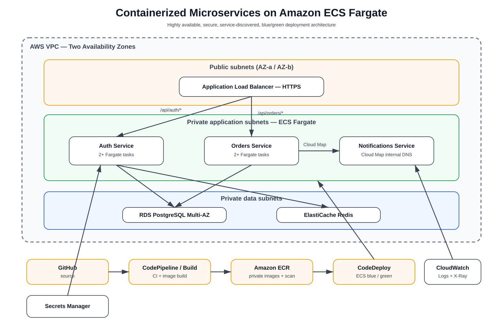

# AWS ECS Fargate Microservices

Graduation project for the **AWS Solutions Architect - Associate** track.

This project implements a containerized microservices architecture using **Amazon ECS on AWS Fargate**, **Amazon ECR**, **Application Load Balancer**, **AWS Cloud Map**, **AWS Secrets Manager**, **Amazon ElastiCache for Redis**, **Amazon RDS for PostgreSQL**, **AWS CodePipeline/CodeBuild/CodeDeploy**, **CloudWatch**, and **AWS X-Ray**.

## Architecture



The application is split into three services:

- **Auth Service** - user registration/login and Redis-backed sessions.
- **Orders Service** - creates and reads orders from PostgreSQL.
- **Notifications Service** - internal service discovered through AWS Cloud Map.

Traffic flow:

1. Clients enter through an Application Load Balancer.
2. `/api/auth/*` is routed to the Auth ECS service.
3. `/api/orders/*` is routed to the Orders ECS service.
4. Orders calls Notifications privately using the Cloud Map DNS name.
5. ECS tasks run in private subnets across two Availability Zones.
6. Secrets are injected at runtime from AWS Secrets Manager.
7. Redis stores shared sessions so ECS tasks remain stateless.
8. CodePipeline/CodeBuild push images to ECR and CodeDeploy performs blue/green ECS deployments.
9. CloudWatch and X-Ray provide logs, metrics, alarms, and distributed traces.

## Repository structure

```text
.
├── architecture/
│   ├── architecture.svg
│   └── architecture.md
├── services/
│   ├── auth-service/
│   ├── orders-service/
│   └── notifications-service/
├── infrastructure/
│   └── terraform/
├── cicd/
│   ├── buildspec.yml
│   └── appspec.yaml
├── database/
│   └── init.sql
├── docs/
│   ├── deployment.md
│   ├── security.md
│   ├── testing.md
│   └── cost-and-cleanup.md
├── docker-compose.yml
└── README.md
```

## Local demo

Prerequisites: Docker and Docker Compose.

```bash
docker compose up --build
```

Then test:

```bash
curl http://localhost:8081/health
curl http://localhost:8082/health
curl http://localhost:8083/health
```

Create a user:

```bash
curl -X POST http://localhost:8081/api/auth/register \
  -H "Content-Type: application/json" \
  -d '{"email":"demo@example.com","password":"Passw0rd!"}'
```

Login:

```bash
curl -X POST http://localhost:8081/api/auth/login \
  -H "Content-Type: application/json" \
  -d '{"email":"demo@example.com","password":"Passw0rd!"}'
```

Use the returned token when creating an order:

```bash
curl -X POST http://localhost:8082/api/orders \
  -H "Content-Type: application/json" \
  -H "Authorization: Bearer <TOKEN>" \
  -d '{"item":"AWS Architecture Book","quantity":1}'
```

## AWS design decisions

### ECS Fargate
Fargate removes EC2 host management. Each service has its own ECS service and task definition and can scale independently.

### Application Load Balancer
The ALB provides Layer 7 path routing:

- `/api/auth/*` -> Auth target group
- `/api/orders/*` -> Orders target group

The Notifications service is internal-only.

### AWS Cloud Map
The Orders service resolves the Notifications service through a private namespace:

```text
notifications.microservices.local
```

### Secrets Manager
Database credentials and application secrets are never stored in source control or container images. ECS injects them at runtime.

### Redis
ElastiCache Redis provides a shared session store so any Auth task can validate a user's session.

### Blue/green deployments
CodeDeploy creates a new ECS task set, validates it through the green target group, shifts traffic, and can roll back automatically if health checks fail.

## High availability

- Two Availability Zones
- Public ALB subnets in both AZs
- Private ECS subnets in both AZs
- Minimum two ECS tasks per public service
- Multi-AZ RDS
- ElastiCache replication group
- ECS Service Auto Scaling

## Security

- ECS, RDS, and Redis are private.
- Only the ALB accepts public traffic.
- Security groups permit only required east-west traffic.
- Secrets Manager stores credentials.
- IAM roles follow least privilege.
- RDS storage encryption is enabled.
- ECR image scanning is enabled.
- CloudWatch captures application logs.

See [docs/security.md](docs/security.md).

## Infrastructure as Code

The `infrastructure/terraform` directory contains a deployable reference Terraform configuration and variable file.

```bash
cd infrastructure/terraform
terraform init
terraform plan
terraform apply
```

Before applying, review variables and AWS costs.

## CI/CD

The reference pipeline flow is:

```text
GitHub -> CodePipeline -> CodeBuild -> ECR -> CodeDeploy -> ECS Fargate
```

`cicd/buildspec.yml` builds and pushes all three Docker images.

## Observability

- CloudWatch Logs for each ECS service
- ALB and ECS metrics
- CloudWatch alarms for unhealthy targets and CPU utilization
- AWS X-Ray SDK instrumentation in each service
- Correlation IDs passed between services

## Validation checklist

- [x] Three independently containerized microservices
- [x] ECS Fargate architecture
- [x] ECR image repositories
- [x] ALB path-based routing
- [x] Cloud Map service discovery
- [x] Secrets Manager integration design
- [x] Redis shared sessions
- [x] PostgreSQL persistence
- [x] Blue/green deployment artifacts
- [x] CloudWatch/X-Ray observability
- [x] Multi-AZ design
- [x] Architecture diagram
- [x] Deployment, testing, security, cost, and cleanup documentation

## Project deliverables

1. **Solution Architecture Diagram** - [architecture/architecture.svg](architecture/architecture.svg)
2. **Public GitHub Repository** - this repository, including implementation and documentation.

## Disclaimer

This repository is a reference graduation project. Deploying the full AWS architecture creates billable AWS resources. Review the cost section and destroy resources after validation.
